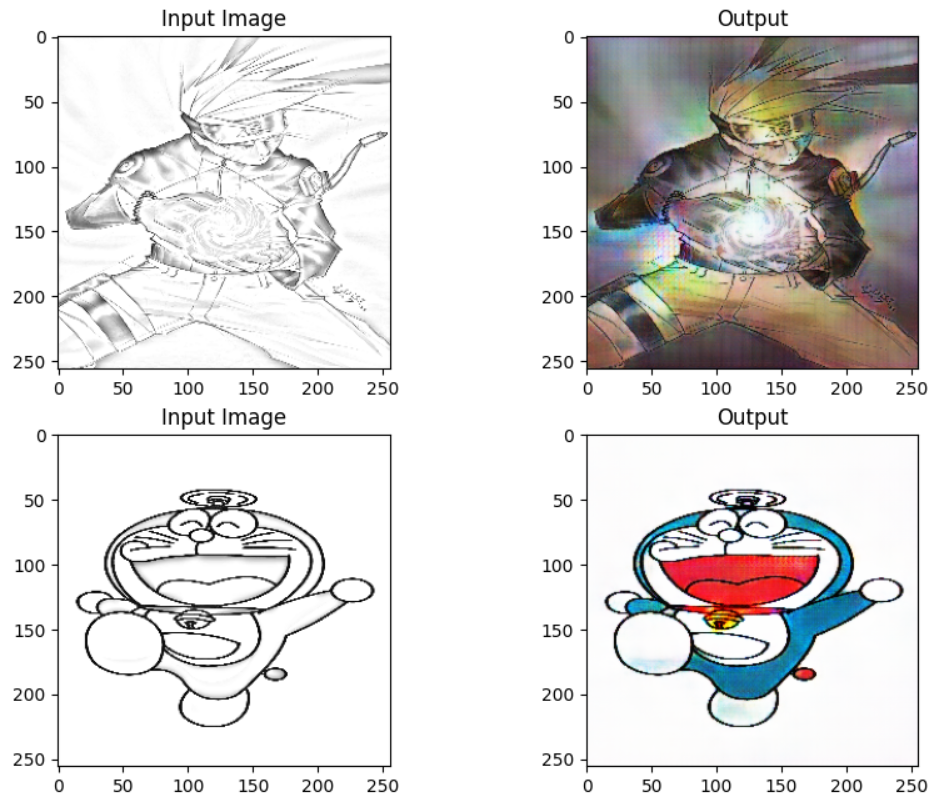
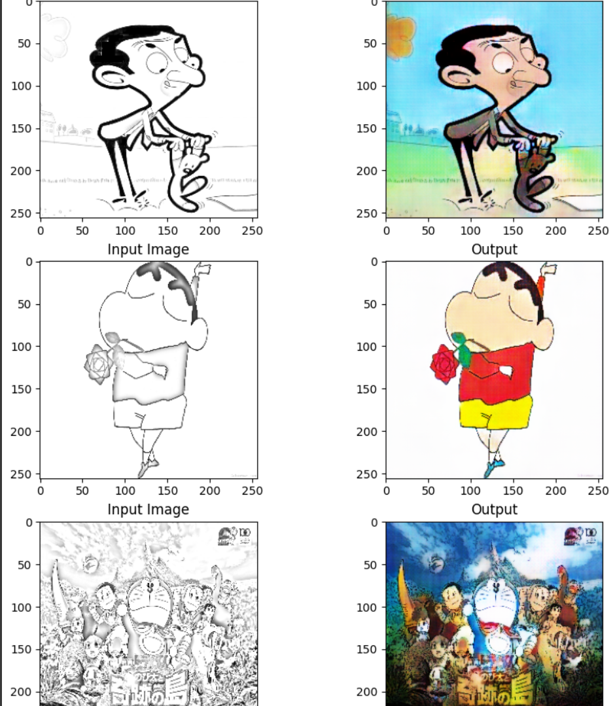
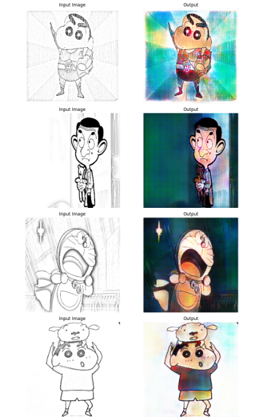

# pix2pix-cartoon-colorizer

This repository contains the implementation of a pix2pix model trained from scratch to colorize sketch images of cartoons. The model was trained for 50 epochs, after which the results were found to be satisfying. This project focuses on converting black-and-white cartoon sketches into colorful images,showcasing the capabilities of generative adversarial networks (GANs) in image-to-image translation.
## ScreenShots

Here are some of the results of my pix2pix model on train as well as test data.

